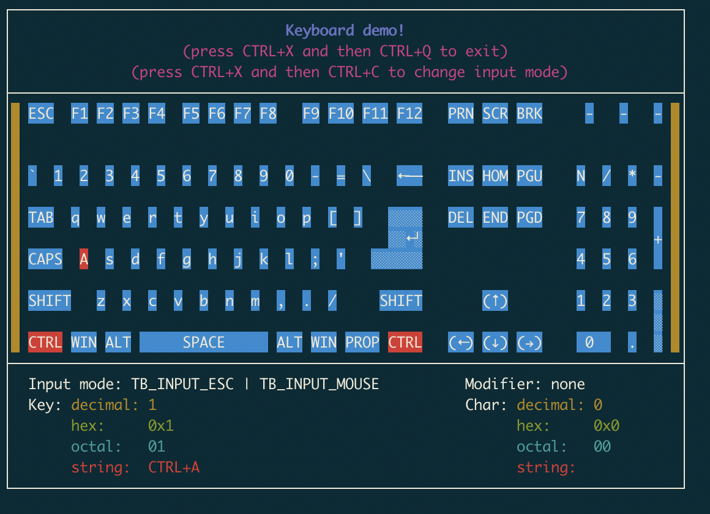

# Termbox for RT-Thread
This repository forks from [nullgemm/termbox_next](https://github.com/nullgemm/termbox_next)

## Getting started
Termbox's interface only consists of 12 functions:
```c
tb_init() // initialization
tb_shutdown() // shutdown

tb_width() // width of the terminal screen
tb_height() // height of the terminal screen

tb_clear() // clear buffer
tb_present() // sync internal buffer with terminal

tb_put_cell()
tb_change_cell()
tb_blit() // drawing functions

tb_select_input_mode() // change input mode
tb_peek_event() // peek a keyboard event
tb_poll_event() // wait for a keyboard event
```
See `termbox.h` header file for full detail.



## Contact information

Maintainer: [Meco Man](https://github.com/mysterywolf)

Homepage: <https://github.com/mysterywolf/termbox>

